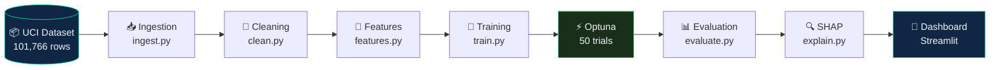

<div align="center">

# 🏥 Diabetes Hospital Readmission Predictor

**End-to-end ML pipeline predicting 30-day hospital readmissions for diabetes patients —
from raw clinical records to a deployed interactive dashboard with SHAP explainability.**

[](https://github.com/contact-prayag-adhikari/diabetes-readmission-predictor/actions)
[](https://www.python.org/)
[](LICENSE)
[](https://your-app-url.streamlit.app)
[](https://archive.ics.uci.edu/dataset/296/)

👉 **[View Interactive README](https://contact-prayag-adhikari.github.io/diabetes-readmission-predictor/)**

</div>

---

## 📌 What This Project Does

Hospital readmissions within 30 days cost the US healthcare system billions annually. The **Hospital Readmissions Reduction Program (HRRP)** penalizes hospitals for excess rates — each preventable readmission costs **$15,000–$25,000**.

This project builds a production-ready ML system that identifies high-risk patients at discharge, enabling targeted interventions before they leave the hospital.

| | |
|---|---|
| 🏥 **Dataset** | UCI Diabetes 130-US Hospitals (1999–2008) |
| 📋 **Records** | 101,766 patient encounters · 50+ clinical features |
| 🎯 **Target** | Readmitted within 30 days (binary classification) |
| 🔒 **Privacy** | Fully de-identified · HIPAA compliant |

---

## 📊 Results

| Model | CV AUROC | Std |
|---|---|---|
| 🥇 **LightGBM (tuned)** | **0.6649** | ±0.0076 |
| Logistic Regression | 0.6612 | ±0.0062 |
| Random Forest | 0.6541 | ±0.0051 |
| XGBoost | 0.6462 | ±0.0055 |

> Best model selected via 5-fold stratified cross-validation, then tuned with **Optuna Bayesian optimization** (50 trials, 9 hyperparameter dimensions).

---

## 🏗️ Pipeline Architecture


---

## 🔬 Methodology

<details>
<summary><b>Phase 1 — Data Pipeline</b> (ingest.py · clean.py · features.py)</summary>

<br/>

**Ingestion**
- Downloads dataset via `ucimlrepo` (id=296), saves raw CSV, loads into SQLite for SQL demos

**Cleaning — 9 steps**
- Removes deceased/hospice patients (`discharge_disposition_id` ∈ {11,13,14,19,20,21}) — prevents data leakage since these patients cannot be readmitted
- Deduplicates by `patient_nbr`, keeping first encounter per patient
- Drops high-missingness columns: `weight` (~97% missing), `payer_code`, `medical_specialty`
- Binary-encodes target: `readmitted == '<30'` → 1, otherwise → 0
- Maps ICD-9 codes (diag_1/2/3) to 17 clinical groups (Circulatory, Endocrine, Respiratory…)
- Median imputation for numeric · "Unknown" fill for categorical

**Feature Engineering — 5 engineered features**

| Feature | Description |
|---|---|
| `prior_visits_total` | Sum of outpatient + emergency + inpatient prior visits |
| `high_utilizer_flag` | 1 if prior_visits_total > 5 |
| `num_medication_changes` | Count of medications with dosage Up/Down |
| `medication_change_flag` | 1 if any medication was changed |
| `total_procedures` | num_lab_procedures + num_procedures |

**Preprocessing pipeline (scikit-learn ColumnTransformer)**
- Numeric (10 features): median imputation → StandardScaler
- Categorical (13 features): constant "Unknown" imputation → OneHotEncoder (max_categories=20)

</details>

<details>
<summary><b>Phase 2 — Model Training & Tuning</b> (train.py)</summary>

<br/>

**4 baseline classifiers** — all with 5-fold stratified CV, scored on AUROC:
- `LogisticRegression` (saga solver, class_weight=balanced)
- `RandomForestClassifier` (200 estimators, class_weight=balanced)
- `XGBClassifier` (200 estimators, logloss eval metric)
- `LGBMClassifier` (200 estimators, class_weight=balanced)

**Optuna Bayesian Tuning** — applied to best baseline (LightGBM):

| Parameter | Search Range |
|---|---|
| n_estimators | 100 – 500 |
| max_depth | 3 – 12 |
| learning_rate | 0.01 – 0.3 (log) |
| num_leaves | 20 – 100 |
| subsample | 0.6 – 1.0 |
| reg_alpha / reg_lambda | 1e-8 – 10.0 (log) |

Model artifact saved as a single `joblib` pickle: fitted model + `ColumnTransformer` + metadata JSON.

</details>

<details>
<summary><b>Phase 3 — Evaluation, Fairness & Explainability</b> (evaluate.py · explain.py)</summary>

<br/>

**Evaluation metrics**
- Primary: AUROC · Secondary: AUPRC, F1, Precision, Recall, Accuracy, Brier Score
- Calibration curves, ROC curves, PR curves, confusion matrix (raw + normalized)
- Threshold optimization via Youden's J statistic and F1 maximization

**Fairness analysis** — subgroup metrics across `race` and `gender`:
- AUROC, Recall, Prediction Rate, Precision, F1 per demographic group
- Saved to `reports/fairness_race.csv` and `reports/fairness_gender.csv`

**SHAP Explainability** — TreeExplainer on 1,000 test samples:
- Global: beeswarm summary plot + mean absolute SHAP bar chart
- Local: force plots per patient, dependence plots for top 3 features
- Plain-language clinical summary auto-generated from top-N features

</details>

---

## 🔍 Top 5 Risk Factors (SHAP)

| Rank | Feature | Clinical Signal |
|---|---|---|
| 🥇 1 | **Number of inpatient visits** | Prior utilization — strongest single predictor |
| 🥈 2 | **Number of medications** | Proxy for disease complexity and comorbidity |
| 🥉 3 | **Time in hospital** | Longer stays correlate with higher risk |
| 4 | **Number of diagnoses** | Comorbidity load signals severity at discharge |
| 5 | **Discharge disposition** | Post-discharge destination affects care continuity |

---

## 🖥️ Dashboard — 5 Pages

| Page | What You See |
|---|---|
| 🏠 **Overview** | Project summary, pipeline diagram, dataset stats |
| 📊 **EDA Explorer** | Interactive distributions, cohort breakdowns, correlations |
| 🤖 **Model Performance** | ROC, PR curves, calibration chart, confusion matrix |
| 🔍 **Explainability** | Global SHAP beeswarm, bar chart, individual force plots |
| 🎯 **Live Predictor** | Patient input form → real-time risk score + SHAP explanation |

---

## 📁 Project Structure
```
diabetes-readmission-predictor/
│
├── run_pipeline.py                  # End-to-end orchestrator (--step all/data/train/evaluate/explain)
├── Makefile                         # make all / data / train / evaluate / explain / app / test
├── requirements.txt
│
├── src/
│   ├── data/
│   │   ├── ingest.py                # Download via ucimlrepo · load to pandas + SQLite
│   │   ├── clean.py                 # 9-step cleaning · ICD-9 grouping · target encoding
│   │   └── features.py              # 5 engineered features · ColumnTransformer preprocessor
│   ├── models/
│   │   ├── train.py                 # 4 classifiers · StratifiedKFold CV · Optuna tuning
│   │   ├── evaluate.py              # AUROC · AUPRC · calibration · fairness analysis
│   │   └── explain.py               # SHAP TreeExplainer · beeswarm · dependence · force plots
│   └── utils/
│       ├── config.py                # Centralized paths, feature lists, hyperparameters
│       └── helpers.py               # Logger · timer decorator · plot utilities
│
├── app/
│   ├── streamlit_app.py             # Multi-page dashboard entry point
│   └── pages/
│       ├── eda_dashboard.py
│       ├── model_performance.py
│       ├── explainability.py
│       └── predict.py               # Live risk predictor with SHAP waterfall
│
├── data/
│   ├── raw/                         # diabetic_data.csv (gitignored)
│   ├── processed/                   # cleaned_data.csv · featured_data.csv
│   └── data_dictionary.md
│
├── models/                          # best_model.pkl · model_metadata.json · shap_data.pkl
├── reports/                         # model_card.md · fairness CSVs · shap_summary.md · figures/
└── tests/
    └── test_data_pipeline.py
```

---

## 🚀 Quick Start
```bash
# 1. Clone & install
git clone https://github.com/contact-prayag-adhikari/diabetes-readmission-predictor.git
cd diabetes-readmission-predictor
pip install -r requirements.txt

# 2. Run full pipeline
make all

# 3. Launch dashboard
make app
```

**Run individual steps:**
```bash
make data       # Phase 1: ingest → clean → feature engineering
make train      # Phase 2: train 4 models → Optuna tuning
make evaluate   # Phase 3: metrics + fairness analysis
make explain    # Phase 3b: SHAP global + local explainability
make test       # Run pytest suite
```

---

## ⚙️ Tech Stack

| Layer | Tools |
|---|---|
| **Data** | pandas · NumPy · SQLite · ucimlrepo |
| **ML** | scikit-learn · XGBoost · LightGBM |
| **Tuning** | Optuna (Bayesian, 50 trials) |
| **Explainability** | SHAP (TreeExplainer) |
| **Visualization** | Matplotlib · Seaborn · Plotly |
| **Dashboard** | Streamlit · Streamlit Cloud |
| **CI/CD** | GitHub Actions · flake8 · pytest · Python 3.10 & 3.11 |

---

## ⚠️ Limitations

- Dataset spans **1999–2008** — clinical practices have evolved significantly since
- Key predictors unavailable: lab values, vital signs, social determinants of health
- External validation on other health systems not yet conducted
- Static model — no monitoring for concept drift in production

---

## 🛡️ Ethics & Fairness

- Dataset is fully **de-identified** — no HIPAA concerns
- **Fairness analysis** conducted across race and gender subgroups
- Model card at `reports/model_card.md` documents intended use, limitations, and demographic risks
- **Not intended for clinical decision-making** without rigorous external validation

---

## 📄 License

MIT License — see [LICENSE](LICENSE) for details.

---

<div align="center">

**Built by [Prayag Adhikari](https://linkedin.com/in/contact-prayag-adhikari)**
MS Information Systems · Northeastern University · Boston, MA

*Data Engineering · Business Intelligence · Healthcare Analytics*

</div>
