# 🏥 Diabetes Hospital Readmission Predictor

[](https://github.com/YOUR_USERNAME/diabetes-readmission-predictor/actions/workflows/ci.yml)
[](https://www.python.org/downloads/)
[](LICENSE)
[](https://YOUR_APP_URL.streamlit.app)

> **End-to-end machine learning pipeline** predicting 30-day hospital readmissions for diabetes patients — from data engineering to deployed interactive dashboard.


---

## 🎯 Problem Statement

Hospital readmissions within 30 days are a critical quality metric in US healthcare. The **Hospital Readmissions Reduction Program (HRRP)** penalizes hospitals with excess readmission rates, costing the industry billions annually. Each preventable readmission costs an estimated **$15,000–$25,000**.

This project builds a machine learning system to **identify high-risk patients at discharge**, enabling:
- Targeted discharge planning interventions
- Optimized follow-up scheduling
- Reduced CMS penalties and healthcare costs

---

## 📊 Results Summary

| Model | AUROC | AUPRC | F1 Score |
|---|---|---|---|
| Logistic Regression | — | — | — |
| Random Forest | — | — | — |
| **XGBoost (Tuned)** | **—** | **—** | **—** |
| LightGBM | — | — | — |

> *Run the pipeline to populate actual metrics*

### Top Risk Factors (SHAP Analysis)
1. **Number of inpatient visits** — strongest predictor of readmission
2. **Number of medications** — proxy for disease complexity
3. **Time in hospital** — longer stays correlate with higher risk
4. **Number of diagnoses** — comorbidity burden
5. **Discharge disposition** — where the patient goes after discharge

---

## 🏗️ Architecture

```mermaid
graph LR
    A[UCI Dataset] --> B[Data Ingestion]
    B --> C[Cleaning & Validation]
    C --> D[Feature Engineering]
    D --> E[Model Training]
    E --> F[Hyperparameter Tuning]
    F --> G[Evaluation & Fairness]
    G --> H[SHAP Explainability]
    H --> I[Streamlit Dashboard]
    I --> J[Streamlit Cloud]
```



---

## 🚀 Quick Start

### Prerequisites
- Python 3.10+
- pip

### Setup
```bash
# Clone the repository
git clone https://github.com/YOUR_USERNAME/diabetes-readmission-predictor.git
cd diabetes-readmission-predictor

# Install dependencies
make setup
# or: pip install -r requirements.txt
```

### Run the Full Pipeline
```bash
# Run everything: data → train → evaluate → explain
make all
# or: python run_pipeline.py --step all
```

### Run Individual Steps
```bash
make data      # Download and process data
make train     # Train and tune models
make evaluate  # Run evaluation suite
make explain   # Generate SHAP analysis
```

### Launch Dashboard
```bash
make app
# or: streamlit run app/streamlit_app.py
```

---

## 📁 Project Structure

```
diabetes-readmission-predictor/
│
├── README.md                        # This file
├── requirements.txt                 # Dependencies
├── Makefile                         # Orchestration commands
├── run_pipeline.py                  # Main pipeline runner
├── LICENSE                          # MIT License
│
├── .github/workflows/ci.yml        # GitHub Actions CI
│
├── data/
│   ├── raw/                         # Original dataset (gitignored)
│   ├── processed/                   # Cleaned & featured data
│   └── data_dictionary.md           # Column documentation
│
├── src/
│   ├── data/
│   │   ├── ingest.py                # Download & load data
│   │   ├── clean.py                 # Data cleaning pipeline
│   │   └── features.py              # Feature engineering
│   ├── models/
│   │   ├── train.py                 # Model training & tuning
│   │   ├── evaluate.py              # Evaluation metrics
│   │   └── explain.py               # SHAP explainability
│   └── utils/
│       ├── config.py                # Centralized configuration
│       └── helpers.py               # Utility functions
│
├── app/
│   ├── streamlit_app.py             # Main dashboard
│   └── pages/
│       ├── eda_dashboard.py         # EDA visualizations
│       ├── model_performance.py     # Model metrics & curves
│       ├── explainability.py        # SHAP analysis
│       └── predict.py               # Live predictor
│
├── models/                          # Saved models (gitignored)
├── reports/                         # Generated reports & figures
└── tests/                           # Unit tests
```

---

## 📋 Methodology

### Data Pipeline
- **Source**: UCI Diabetes 130-US Hospitals dataset (101,766 encounters, 50+ features)
- **Cleaning**: Missing value imputation, ICD-9 code grouping, deceased patient removal, duplicate handling
- **Features**: 13 engineered features including prior visit aggregates, medication change counts, and comorbidity indicators

### Modeling
- **Baseline models**: Logistic Regression, Random Forest, XGBoost, LightGBM
- **Tuning**: Optuna Bayesian optimization (50 trials)
- **Evaluation**: AUROC (primary), AUPRC, calibration, fairness analysis across race and gender

### Explainability
- **SHAP**: Global feature importance, individual prediction explanations, feature interaction analysis
- **Fairness**: Equalized odds and prediction rates across demographic subgroups

---

## 🔑 Key Findings

1. **Prior inpatient visits** are the strongest predictor — patients with >2 prior admissions have significantly elevated risk
2. **Medication complexity** (number of medications, medication changes) signals disease severity
3. **The model is reasonably calibrated** — predicted probabilities align with actual readmission rates
4. **Fairness analysis** reveals demographic differences that should be monitored in production

---

## ⚠️ Limitations & Future Work

- **Dataset age**: Data is from 1999–2008; clinical practices have evolved
- **Feature availability**: Some valuable features (e.g., lab results, vitals) are not in this dataset
- **External validation**: Model should be validated on data from other health systems
- **Temporal dynamics**: Current model is static; monitoring for concept drift would be needed in production

### Potential Extensions
- [ ] MLflow experiment tracking
- [ ] Docker containerization
- [ ] FastAPI REST endpoint
- [ ] Data versioning with DVC
- [ ] Real-time monitoring dashboard

---

## 🛡️ Ethics & Privacy

- Dataset is **fully de-identified** (no HIPAA concerns)
- **Fairness analysis** included across race and gender
- Model limitations are **prominently documented**
- Not intended for clinical use without proper validation

---

## 📄 License

This project is licensed under the MIT License — see [LICENSE](LICENSE) for details.

---

## 🙏 Acknowledgments

- [UCI Machine Learning Repository](https://archive.ics.uci.edu/dataset/296/) for the dataset
- Strack et al. (2014) for the original research paper
- SHAP library by Scott Lundberg
